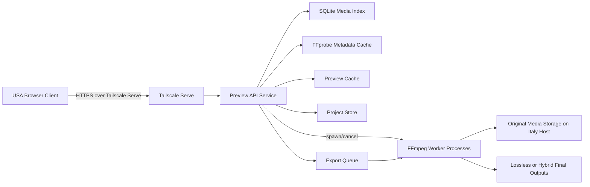
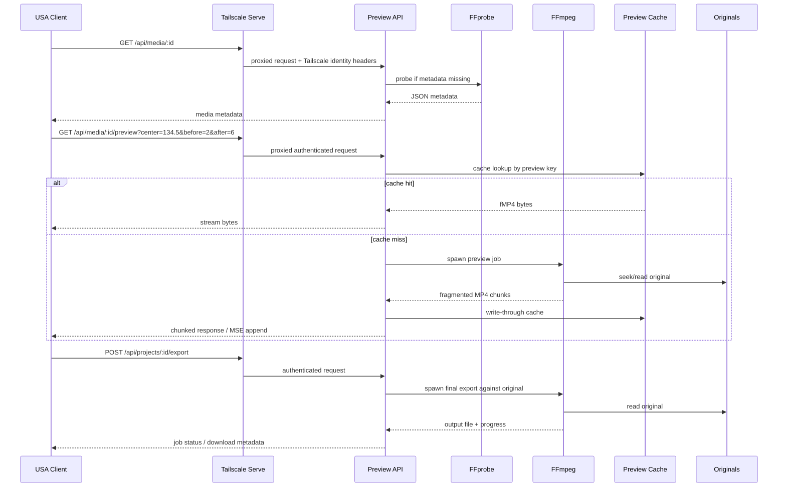

# On-Demand Remote Video Preview and Lossless Export Over Tailscale

## Executive summary

The right design for an Italy-host / USA-client editing workflow is **not** remote desktop for the main editing loop. It is a split system: keep the original files and the final export pipeline on the **Italy host**, generate **short 720p preview clips on demand** close to the originals, stream only those previews over Tailscale to a **browser client in the USA**, and execute the **final export against the original media on the host** using FFmpeg stream copy wherever cuts align with source constraints. This architecture minimizes transatlantic bandwidth, keeps the expensive decode/seek work next to the storage, and preserves the possibility of lossless final output. FFmpeg can read regular files and pipes, write to pipes or network outputs, perform accurate input seeking with `-ss`, and perform stream copy with `-c copy` when re-encoding is not required. Tailscale Serve can expose a localhost-only backend over HTTPS to the tailnet, inject identity headers, and forward app capabilities headers for application-layer authorization. Browser playback should use Media Source Extensions with fragmented MP4 as the main delivery format because MSE is explicitly designed for applications that append media segments dynamically to `SourceBuffer` objects. citeturn9view0turn10view0turn10view4turn16view1turn6view0turn7view0turn7view1

The most practical implementation choice is **Go for the backend** and **TypeScript for the web client**. Go gives you cheap goroutines, a solid standard HTTP stack, simple subprocess orchestration, and straightforward deployment as a static binary. Rust can produce a very strong long-term implementation, but usually at higher development cost. Python/FastAPI is an excellent prototype path because `asyncio` and `StreamingResponse` are well-suited to streaming chunked output from FFmpeg, but the backend language matters less than it would in a normal video service because the core video work is offloaded to FFmpeg subprocesses rather than implemented in the application runtime itself. That last point is an engineering inference from FFmpeg’s architecture and the proposed design, not a claim from a benchmark. citeturn4search0turn4search1turn4search3turn4search4turn5search1turn5search2turn9view0turn10view4

**Assumptions**

- The Italy host has local access to the original media files.
- The USA client is an interactive browser user inside the same Tailscale tailnet.
- Authentication is primarily delegated to Tailscale identity.
- Preview generation may be software-encoded or hardware-accelerated depending on the host GPU.
- Final “lossless” output means FFmpeg stream copy where feasible; exact arbitrary-frame cuts may still require boundary re-encoding because stream copy is constrained by source structure.

## Proposed architecture

At a high level, the system has five responsibilities: media discovery, metadata extraction, preview generation, project state management, and final export. Tailscale provides private transport and identity; the application provides timeline logic, caching, authorization, and job control. Tailscale normally prefers direct UDP connections and falls back to relayed connections such as DERP when direct connectivity is not possible, so preview responsiveness is materially better when the tailnet path is direct rather than relayed. citeturn17search0turn17search6



The browser should not fetch originals directly. It should fetch metadata, thumbnails, and short preview segments. The backend should perform timeline-to-window translation, cache lookups, single-flight de-duplication, FFmpeg process control, and project persistence. FFprobe is the correct tool for metadata extraction because it is designed to gather machine-readable stream and container information and emit it in parseable formats such as JSON. MSE is the right browser primitive because it allows the application to construct media playback by appending segments to `SourceBuffer` objects rather than relying on one monolithic file. citeturn9view3turn7view1turn7view2

### Component responsibilities

| Component | Responsibility | Notes |
|---|---|---|
| Web client | Timeline UI, transport control, preview playback, segment editing | Use MSE and `MediaSource.isTypeSupported()` to confirm support for chosen MIME types before creating `SourceBuffer`s. citeturn7view2 |
| Preview API | AuthN/AuthZ, request validation, cache lookup, FFmpeg orchestration, cancellation | If served through Tailscale Serve, it can consume `Tailscale-User-Login` and optional `Tailscale-App-Capabilities` headers. citeturn6view0turn16view1 |
| Metadata service | Probe duration, streams, codecs, dimensions, frame rate, audio presence | FFprobe is built for this exact job and emits machine-readable output to stdout. citeturn9view3 |
| Preview cache | Store generated 720p short fMP4 previews and thumbnails | Fragmented MP4 is appropriate for incremental delivery, though FFmpeg notes fragmented output is somewhat less compatible than regular MP4. citeturn12view0turn11view4 |
| Export service | Run final stream-copy or hybrid export against originals | FFmpeg stream copy is fast and avoids quality loss where compatible. citeturn10view4 |
| Tailscale | Private access, HTTPS termination, identity propagation, optional path routing | Serve can reverse proxy localhost backends, inject identity headers, and resume background sharing after reboot when launched with `--bg`. citeturn16view1turn6view0 |

### Data flow



A direct Tailscale path is preferable because the preview model is interactive and latency-sensitive. Even though the preview clips are small, each request still pays for a round trip, host seek/decode, and time-to-first-byte. If the tailnet falls back to DERP, latency and jitter usually get worse. citeturn17search0turn17search1turn17search11

## API and runtime design

The backend should be explicitly **window-based**, not frame-API based. The browser asks for a short region around the selected timeline position. That keeps server semantics simple, increases cache reuse, and makes future prefetching predictable.

### API specification

| Method | Endpoint | Purpose | Main params | Response |
|---|---|---|---|---|
| `GET` | `/api/media` | List known media | optional filters, pagination | JSON array of media summaries |
| `GET` | `/api/media/{mediaId}` | Metadata for one item | none | JSON with duration, streams, codecs, dimensions |
| `GET` | `/api/media/{mediaId}/thumbnails` | Timeline thumbs manifest | stride, viewport range | JSON list of URLs or signed internal refs |
| `GET` | `/api/media/{mediaId}/preview` | Stream short preview window | `center`, `before`, `after`, optional `mute=1`, optional `fps` | `video/mp4` fragmented stream |
| `HEAD` | `/api/media/{mediaId}/preview` | Fast existence check for prefetched item | same key params | headers only |
| `PUT` | `/api/projects/{projectId}` | Save project state | body with segments, labels, active media | JSON project record |
| `GET` | `/api/projects/{projectId}` | Load project | none | JSON project record |
| `POST` | `/api/projects/{projectId}/export` | Queue final export | export mode, output container, strategy | `202 Accepted` + job id |
| `GET` | `/api/jobs/{jobId}` | Poll job state | none | JSON status/progress |
| `DELETE` | `/api/jobs/{jobId}` | Cancel active preview/export | none | `204 No Content` |
| `GET` | `/metrics` | OpenMetrics/Prometheus endpoint | none | `text/plain` metrics |

### Recommended endpoint contracts

```json
// GET /api/media/{mediaId}
{
  "id": "sha256:9d7d...",
  "name": "camera_A_take_17.mkv",
  "pathHint": "camera_A_take_17.mkv",
  "durationSec": 1847.423,
  "sizeBytes": 28491457329,
  "container": "matroska,webm",
  "streams": {
    "video": {
      "codec": "hevc",
      "width": 3840,
      "height": 2160,
      "avgFrameRate": "30000/1001"
    },
    "audio": {
      "codec": "aac",
      "channels": 2
    }
  },
  "etag": "media:6b0f..."
}
```

```json
// PUT /api/projects/{projectId}
{
  "mediaId": "sha256:9d7d...",
  "revision": 12,
  "segments": [
    { "startSec": 134.500, "endSec": 161.250, "label": "Intro" },
    { "startSec": 240.750, "endSec": 322.100, "label": "Main" }
  ],
  "uiState": {
    "playheadSec": 134.500,
    "zoom": 12,
    "muted": false
  }
}
```

```json
// POST /api/projects/{projectId}/export
{
  "mode": "merge",
  "cutStrategy": "stream_copy_preferred",
  "container": "mkv",
  "smartBoundaryReencode": false
}
```

### Cache key design

Cache keys should be deterministic, content-aware, and explicit about encoder settings. A good pattern is to hash a canonical JSON payload:

```json
{
  "v": 3,
  "media": {
    "id": "sha256:9d7d...",
    "sizeBytes": 28491457329,
    "mtimeNs": 1764167753000000000
  },
  "preview": {
    "startMs": 132500,
    "durationMs": 8000,
    "width": 1280,
    "height": 720,
    "fps": 30,
    "audio": true,
    "videoCodec": "h264",
    "audioCodec": "aac",
    "mux": "fmp4"
  },
  "encoder": {
    "profile": "preview-v1",
    "impl": "libx264-ultrafast-crf28"
  }
}
```

```text
cache_key = sha256(canonical_json)
cache_path = previews/ab/cd/<cache_key>.mp4
```

**Why this shape**

A media fingerprint based only on path is unsafe; the same path can be replaced. Adding file size and nanosecond mtime makes stale reuse much less likely. Including the encoder profile in the key avoids collisions when you later tune CRF, GOP, fragment behavior, or pixel format. FFprobe should be the source of the metadata object where possible, because it is designed to emit stable machine-readable stream information. citeturn9view3

### Concurrency and resource limits

This system should be **strictly bounded**. Unbounded FFmpeg fan-out is the easiest way to turn an interactive editor into a self-denial-of-service.

| Control | Recommendation | Rationale |
|---|---|---|
| Global active preview jobs | Start with `1–2` for software encode; `2–4` for tested hardware encode | Most cost is decode/seek/encode on the host; keep the system interactive instead of throughput-maximized. |
| Per-user active preview jobs | `1` | A single editor normally needs only one foreground preview. |
| Single-flight de-duplication | Required | If two identical preview requests arrive, only one FFmpeg job should run. |
| Request debounce in UI | `150–250 ms` after drag settles | Prevents one job per mouse event. |
| Queue length | small, e.g. `4–8` pending preview jobs per user | Beyond that, cancel instead of queueing stale work. |
| Auto-cancel on disconnect | Required | If the client disconnects, terminate FFmpeg promptly. |
| Export concurrency | `1` by default | Final export should not starve interactive preview generation. |
| Disk cache budget | start with `10–50 GB` | Large enough for reuse, small enough for safe eviction. |

Implement cancellation end to end. In the browser, abort stale fetches. In the backend, tie request context cancellation to child process termination. In the worker layer, write cache entries to a temporary path and atomically rename on success so that partial outputs are never treated as cache hits.

## FFmpeg and media pipeline

The preview pipeline should normalize heterogeneous originals into a browser-friendly preview format. MDN explicitly describes H.264 video, AAC audio, and MP4 container as a common MSE baseline, even though MSE overall does not require support for any specific format. FFmpeg’s MOV/MP4 muxer supports fragmentation, including `frag_duration`, `frag_keyframe`, and `default_base_moof`; fragmented files are decodable even if interrupted and use less memory while being written, though FFmpeg also warns that fragmented MP4 is less compatible with some applications than regular MP4. Tailscale transport does not change these media constraints; it only provides the secure path. citeturn7view0turn7view1turn12view0turn11view4

### Metadata and thumbnail stage

Probe once per media item and cache aggressively.

```bash
ffprobe \
  -v error \
  -show_entries format=duration,size,format_name:stream=index,codec_type,codec_name,width,height,avg_frame_rate,channels \
  -of json \
  /media/originals/camera_A_take_17.mkv
```

FFprobe is designed for machine-readable output and should be treated as the source of truth for metadata snapshots. citeturn9view3

Generate low-cost thumbnails independently from preview clips, so broad timeline movement does not require transcoding:

```bash
ffmpeg \
  -hide_banner -loglevel error \
  -i /media/originals/camera_A_take_17.mkv \
  -vf "fps=1/10,scale=240:-2" \
  -q:v 5 \
  /cache/thumbs/camera_A_take_17/frame-%06d.jpg
```

### Preview generation logic

Use **input-side `-ss`** for speed. FFmpeg documents that input `-ss` seeks to the nearest earlier seek point, and with accurate seek enabled by default, the extra segment between seek point and target position is decoded and discarded during transcoding. That is exactly what you want for preview generation. citeturn10view0turn10view2

A good default window is **8 seconds total**, centered asymmetrically around the chosen point. For example, if the user clicks `134.5`, request `before=2` and `after=6`; the selected point becomes `2.0` seconds into the preview buffer. That gives pre-roll without making the clip unnecessarily large.

### Software preview template

```bash
ffmpeg \
  -nostdin \
  -hide_banner \
  -loglevel error \
  -ss 132.500 \
  -i /media/originals/camera_A_take_17.mkv \
  -t 8 \
  -map 0:v:0 \
  -map '0:a:0?' \
  -vf "scale=1280:720:force_original_aspect_ratio=decrease:force_divisible_by=2,\
pad=1280:720:(ow-iw)/2:(oh-ih)/2:black,fps=30" \
  -c:v libx264 \
  -preset ultrafast \
  -tune zerolatency \
  -crf 28 \
  -pix_fmt yuv420p \
  -g 30 \
  -keyint_min 30 \
  -sc_threshold 0 \
  -c:a aac \
  -b:a 96k \
  -ac 2 \
  -ar 48000 \
  -movflags +frag_keyframe+empty_moov+default_base_moof \
  -frag_duration 500000 \
  -f mp4 \
  pipe:1
```

This template follows FFmpeg’s documented fragmentation model and produces a browser-friendly fMP4 stream. FFmpeg explicitly supports writing to pipes and network outputs, not only to completed files. The `default_base_moof` flag exists to make fragments easier to parse in some cases by avoiding absolute offsets, which is helpful for incremental consumers. citeturn9view0turn10view3turn12view0

### VAAPI preview template

FFmpeg’s VAAPI encoders accept **VAAPI hardware surfaces**; if the input frames start in software, FFmpeg’s own codec docs say to use `hwupload` to move them to the GPU. citeturn9view2

```bash
ffmpeg \
  -nostdin \
  -hide_banner \
  -loglevel error \
  -ss 132.500 \
  -i /media/originals/camera_A_take_17.mkv \
  -t 8 \
  -map 0:v:0 \
  -map '0:a:0?' \
  -vaapi_device /dev/dri/renderD128 \
  -vf "scale=1280:720:force_original_aspect_ratio=decrease:force_divisible_by=2,\
pad=1280:720:(ow-iw)/2:(oh-ih)/2:black,format=nv12,hwupload,fps=30" \
  -c:v h264_vaapi \
  -qp 27 \
  -g 30 \
  -c:a aac \
  -b:a 96k \
  -ac 2 \
  -movflags +frag_keyframe+empty_moov+default_base_moof \
  -frag_duration 500000 \
  -f mp4 \
  pipe:1
```

### NVENC preview template

```bash
ffmpeg \
  -nostdin \
  -hide_banner \
  -loglevel error \
  -ss 132.500 \
  -i /media/originals/camera_A_take_17.mkv \
  -t 8 \
  -map 0:v:0 \
  -map '0:a:0?' \
  -vf "scale=1280:720:force_original_aspect_ratio=decrease:force_divisible_by=2,\
pad=1280:720:(ow-iw)/2:(oh-ih)/2:black,fps=30,format=yuv420p" \
  -c:v h264_nvenc \
  -preset p1 \
  -tune ll \
  -cq 28 \
  -g 30 \
  -c:a aac \
  -b:a 96k \
  -ac 2 \
  -movflags +frag_keyframe+empty_moov+default_base_moof \
  -frag_duration 500000 \
  -f mp4 \
  pipe:1
```

FFmpeg documents hardware acceleration mechanisms such as `vaapi` and `qsv`, and the FFmpeg codebase includes NVENC support for hardware H.264/HEVC/AV1 encoding. Actual runtime availability depends on hardware and drivers, so the service should probe capabilities at startup and select the best profile dynamically. citeturn18search7turn18search6turn9view2

### Browser playback by MSE

The production path should use MSE rather than waiting for a full `Blob`.

```ts
const mime = 'video/mp4; codecs="avc1.42E01E, mp4a.40.2"';

if (!("MediaSource" in window) || !MediaSource.isTypeSupported(mime)) {
  throw new Error("Unsupported preview MIME type");
}

const ms = new MediaSource();
video.src = URL.createObjectURL(ms);

ms.addEventListener("sourceopen", async () => {
  const sb = ms.addSourceBuffer(mime);
  const resp = await fetch(previewUrl, { signal: abortController.signal });
  const reader = resp.body!.getReader();

  let pending: Uint8Array[] = [];
  let appending = false;

  const pump = async () => {
    if (appending || sb.updating || pending.length === 0) return;
    appending = true;
    sb.appendBuffer(pending.shift()!);
  };

  sb.addEventListener("updateend", () => {
    appending = false;
    pump();
  });

  while (true) {
    const { done, value } = await reader.read();
    if (done) break;
    pending.push(value);
    pump();
  }

  ms.endOfStream();
});
```

MDN and the W3C MSE specification both describe this model directly: the application creates a `MediaSource`, adds one or more `SourceBuffer`s, and appends data segments dynamically. citeturn7view0turn7view1turn7view2

### Final export templates

When exact stream-copy is possible, use `-c copy`:

```bash
ffmpeg \
  -ss 132.500 \
  -to 161.250 \
  -i /media/originals/camera_A_take_17.mkv \
  -map 0 \
  -c copy \
  /exports/segment_001.mkv
```

For multi-segment merged exports, use the concat demuxer if the segments are independently stream-copy-safe and compatible:

```text
ffconcat version 1.0
file '/exports/tmp/seg_001.mkv'
file '/exports/tmp/seg_002.mkv'
file '/exports/tmp/seg_003.mkv'
```

```bash
ffmpeg -f concat -safe 0 -i segments.ffconcat -c copy /exports/final_cut.mkv
```

FFmpeg documents stream copy as packet-level remuxing with no decoding or encoding, which makes it fast and avoids quality loss, but it also notes that stream copy can fail in some cases because of container or stream constraints. The concat demuxer requires compatible streams and relies on durations and timestamps being sane. citeturn10view4turn9view1

## Security, deployment, and observability

The cleanest security model is to expose the application **only** through Tailscale Serve and keep the backend bound to localhost. Tailscale’s Serve docs explicitly say the backend should ideally listen only on localhost when using identity headers, because otherwise a direct caller could spoof header values if they can bypass Serve. Serve injects `Tailscale-User-Login`, `Tailscale-User-Name`, and optional `Tailscale-App-Capabilities` headers, and strips any incoming versions of those headers to prevent spoofing. Serve traffic is available only within the tailnet unless you intentionally use Funnel, which should be avoided here. citeturn6view0turn16view1

### Tailscale authorization model

Use **three layers**:

- **Network access** via Tailscale grants or ACLs, with grants preferred by Tailscale for new policy. citeturn3search0turn3search3turn6view3
- **Application identity** from `Tailscale-User-Login`. citeturn6view0
- **Application capabilities** from `Tailscale-App-Capabilities` for feature-level rights such as `preview`, `export`, and `admin`. Tailscale documents app capabilities as JSON objects that applications define and interpret themselves. citeturn6view0turn6view1turn6view2

Example tailnet policy sketch:

```json
{
  "grants": [
    {
      "src": ["group:video-editors"],
      "dst": ["tag:remote-video-host:*"],
      "app": {
        "example.com/preview": [{}],
        "example.com/export": [{ "mode": "stream_copy_preferred" }]
      }
    }
  ],
  "tests": [
    {
      "src": "editor@example.com",
      "proto": "tcp",
      "accept": ["remote-video-host:443"]
    }
  ]
}
```

Tailscale supports policy-file tests that are evaluated when the tailnet policy changes, which is useful for preventing accidental exposure. citeturn6view3

### Rate limits and abuse controls

Because preview generation is CPU-, disk-, and GPU-expensive, the app should enforce coarse rate limits **after** Tailscale identity is established:

- Token bucket by `Tailscale-User-Login`.
- Hard limit of one active preview job per user.
- Separate export permission and stricter export concurrency.
- Automatic cancellation of superseded preview jobs from the same user.
- Request normalization so tiny timestamp changes coalesce into the same cache bucket.

These are application design controls rather than protocol requirements, but they fit naturally with Tailscale’s header-based identity model. citeturn6view0turn6view1

### Deployment options

| Option | Best fit | Strengths | Trade-offs |
|---|---|---|---|
| **systemd on the Italy host** | Recommended default | Simple, local to storage/GPU, minimal moving parts | Less portable between environments |
| **Docker / Compose** | Good when you want repeatable packaging | Standard container workflow, health checks, volume mapping | GPU device access and Tailscale integration need care |
| **Kubernetes** | Only if you already run a cluster | Strong rollout/probe model, scheduling, scaling | Highest operational overhead; rarely justified for a single-host media processor |

Docker supports `HEALTHCHECK`, and Compose exposes the `healthcheck` service attribute. Kubernetes Deployments are the standard controller for stateless app rollout, and readiness/liveness probes are the correct health primitives. Tailscale also supports Kubernetes deployments through the Kubernetes Operator, as well as sidecar and proxy patterns. citeturn13search1turn13search4turn13search2turn13search3turn3search2turn3search6

A practical **systemd** layout:

```ini
# /etc/systemd/system/remote-preview.service
[Unit]
Description=Remote video preview API
After=network-online.target tailscaled.service
Wants=network-online.target

[Service]
User=video
Group=video
WorkingDirectory=/srv/remote-preview
EnvironmentFile=/etc/remote-preview.env
ExecStart=/srv/remote-preview/bin/server
Restart=on-failure
RestartSec=2
NoNewPrivileges=true
PrivateTmp=true
ProtectSystem=strict
ProtectHome=read-only
ReadWritePaths=/srv/remote-preview/cache /srv/remote-preview/projects /srv/remote-preview/exports
MemoryMax=2G

[Install]
WantedBy=multi-user.target
```

A Tailscale Serve command that follows official guidance:

```bash
tailscale serve --bg --https=443 --accept-app-caps=example.com/preview,example.com/export localhost:8787
```

Serve officially supports HTTPS reverse proxying to a local backend, automatic certificate provisioning, background persistence with `--bg`, and forwarding app capabilities headers with `--accept-app-caps`. citeturn16view1turn6view0

### Monitoring and metrics

Expose a `/metrics` endpoint in **OpenMetrics / Prometheus format** and instrument at least:

- request count and latency by route
- preview cache hit ratio
- FFmpeg spawn count, error count, and run duration
- active preview jobs
- active export jobs
- preview time-to-first-byte
- bytes streamed per preview
- cancellation count
- queue depth
- host-level disk usage for cache and exports

The Prometheus ecosystem’s text exposition format is a core design feature, and Kubernetes components themselves emit metrics in Prometheus format; OpenTelemetry metrics are useful if you want vendor-neutral instrumentation and exporting. citeturn14search0turn14search1turn14search7

## Technology evaluation and delivery plan

### Language and framework comparison

| Stack | CPU overhead | Concurrency model | Ecosystem fit for this problem | Strengths | Weaknesses |
|---|---|---|---|---|---|
| **Python + FastAPI** | Higher interpreter overhead than compiled options, but usually acceptable because FFmpeg does the heavy video work | `asyncio` coroutines; good for I/O-bound streaming | Excellent for rapid API development, validation, and orchestration | Fastest prototype path; `StreamingResponse` is a natural match | Lower raw efficiency for control-plane logic; packaging less self-contained than Go |
| **Node + Express** | Moderate JS runtime overhead; single-threaded JS event loop by default | Event loop + non-blocking I/O | Strong frontend adjacency, weaker than Go/Rust for long-lived process orchestration ergonomics | One language across frontend and backend | CPU-heavy work must be offloaded; callbacks/streams are workable but less pleasant for this backend |
| **Go + net/http** | Low runtime overhead; compiled static binary | Lightweight goroutines and channels | Excellent for HTTP streaming, subprocess supervision, operational simplicity | Best balance of performance, simplicity, and deployability | Less batteries-included validation than FastAPI unless you choose libraries |
| **Rust + Tokio + Axum** | Lowest control-plane overhead in this group | Async runtime, work-stealing scheduler, strong type safety | Excellent for long-lived high-confidence services | Highest correctness and performance ceiling | Highest implementation complexity and development cost |

The concurrency and framework characteristics above are grounded in the official docs: Python’s `asyncio` is the basis for asynchronous frameworks, FastAPI supports chunked streaming with `StreamingResponse`, Node documents its single-threaded default event loop, Go documents goroutines as lightweight concurrent execution units, and Tokio describes its multithreaded async runtime. Express is intentionally middleware-centric and minimal; Axum is ergonomic and modular on top of Tokio. citeturn4search0turn4search1turn4search2turn4search3turn4search4turn5search0turn5search1turn5search2

**Recommended choice:** **Go backend + TypeScript frontend**. The main reason is not codec throughput — FFmpeg is the codec engine either way — but operational quality: small memory footprint, simple cancellation and piping, static binaries, good HTTP streaming, and a straightforward path from prototype to production. If the team already ships Python heavily and expects low concurrency, **FastAPI is a valid first implementation** and can be migrated later. citeturn9view0turn10view4turn4search1turn5search1

### Recommended project structure

```text
remote-preview/
├── cmd/
│   └── server/
│       └── main.go
├── internal/
│   ├── api/
│   │   ├── middleware/
│   │   ├── routes_media.go
│   │   ├── routes_projects.go
│   │   ├── routes_jobs.go
│   │   └── routes_metrics.go
│   ├── auth/
│   │   ├── tailscale_headers.go
│   │   └── capabilities.go
│   ├── media/
│   │   ├── probe.go
│   │   ├── thumbnails.go
│   │   ├── preview.go
│   │   └── export.go
│   ├── cache/
│   │   ├── key.go
│   │   ├── store.go
│   │   └── eviction.go
│   ├── jobs/
│   │   ├── manager.go
│   │   ├── singleflight.go
│   │   └── limits.go
│   ├── store/
│   │   ├── sqlite.go
│   │   └── migrations/
│   ├── metrics/
│   │   └── metrics.go
│   └── config/
│       └── config.go
├── web/
│   ├── src/
│   │   ├── mse/
│   │   ├── api/
│   │   ├── timeline/
│   │   └── app.ts
│   └── package.json
├── deployments/
│   ├── systemd/
│   ├── docker/
│   └── k8s/
├── test/
│   ├── integration/
│   ├── fixtures/
│   └── ffmpeg-samples/
├── .github/
│   └── workflows/
└── README.md
```

### CI/CD suggestions

Use GitHub Actions for CI/CD. The baseline workflow should:

- build backend and frontend
- run unit tests
- run integration tests with small fixture media
- run browser tests for timeline + MSE behavior
- build a container image
- publish versioned artifacts on tags
- deploy to the host through a controlled release job

GitHub Actions is explicitly intended to automate build, test, and deployment workflows. citeturn15search2

A minimal staged pipeline:

```yaml
name: ci

on:
  push:
  pull_request:

jobs:
  build-test:
    runs-on: ubuntu-latest
    steps:
      - uses: actions/checkout@v4
      - name: Install FFmpeg
        run: sudo apt-get update && sudo apt-get install -y ffmpeg
      - name: Build backend
        run: go build ./...
      - name: Test backend
        run: go test ./...
      - name: Build frontend
        run: cd web && npm ci && npm run build
      - name: Run browser tests
        run: cd web && npx playwright test
```

## Testing, failure modes, and recovery

The system needs three layers of tests: deterministic unit tests, FFmpeg-backed integration tests, and browser-level end-to-end tests. Pytest’s fixture model is a good reference for what “good test fixtures” should achieve even if the final backend is not Python, and Playwright is a strong choice for end-to-end browser testing because it drives Chromium, Firefox, and WebKit and provides trace-based debugging. Playwright’s docs explicitly emphasize automatic waiting and reduced test flakiness. citeturn15search0turn15search1turn15search11turn15search15

### Example unit and integration tests

| Test type | Example | Expected result |
|---|---|---|
| Unit | Cache key canonicalization for equivalent requests | Same semantic request yields same hash |
| Unit | Capability parsing from `Tailscale-App-Capabilities` | Correct allow/deny decisions |
| Unit | Debounce/cancel state machine | Newer preview request cancels older one |
| Integration | FFprobe on sample MP4/MKV/MOV/HEVC source | Metadata parsed correctly |
| Integration | Preview endpoint returns valid fMP4 | Browser can append and play |
| Integration | Client disconnect during preview | FFmpeg process exits quickly |
| Integration | Export job with stream-copy-safe cuts | Output codecs match source where expected |
| E2E | Drag timeline, stop, preview starts near target point | Playhead starts at expected offset |
| E2E | Rapid multiple selections | Only the latest preview is presented |
| E2E | Unauthorized user attempts export | `403` with no FFmpeg spawn |

### Failure modes and recovery

| Failure mode | Symptom | Likely cause | Recovery strategy |
|---|---|---|---|
| Tailscale path shifts to DERP | Previews become sluggish | NAT/firewall conditions changed | Alert on latency increase; check `tailscale ping` / connectivity; keep previews small |
| Preview never starts | MSE append or mux issue | Unsupported MIME, bad fragments, codec mismatch | Validate `MediaSource.isTypeSupported()` and keep preview profile conservative |
| FFmpeg exits immediately | `500` or empty preview | Missing codec, bad input, hardware path broken | Fall back from hardware profile to software profile automatically |
| Cache corruption | Repeated playback failures on “hits” | Partial file treated as complete | Write to temp file, fsync if needed, atomic rename only on success |
| Export job starves previews | UI feels frozen | Unbounded export concurrency | Separate export semaphore from preview semaphore |
| Header spoofing risk | Unauthorized access escalation | Backend exposed directly off localhost | Bind app to localhost only and expose only via Serve |
| Storage full | Preview generation or export fails | Cache growth, stale exports | LRU cache eviction, export retention policy, alert on disk watermark |
| Browser memory bloat | Tab gets slow | MSE buffers not trimmed | Explicitly remove old buffered ranges, recreate `MediaSource` on long sessions |

### Recovery principles

Treat preview generation as **disposable work** and final export as **durable work**. Preview jobs should be cheap to cancel and never retried automatically more than once. Export jobs should be resumable at the orchestration level, logged with enough context to re-run, and stored with explicit status transitions.

### Suggested implementation phases

Start with a narrow, reliable slice:

1. metadata API with FFprobe
2. preview endpoint with software `libx264` fMP4
3. browser MSE player
4. project save/load
5. single active export with stream copy
6. metrics and cancellation
7. hardware acceleration profiles
8. thumbnails and adjacent-window prefetch
9. richer authorization through Tailscale app capabilities

That sequencing keeps the system useful early while avoiding premature complexity in GPU handling and advanced scheduling.